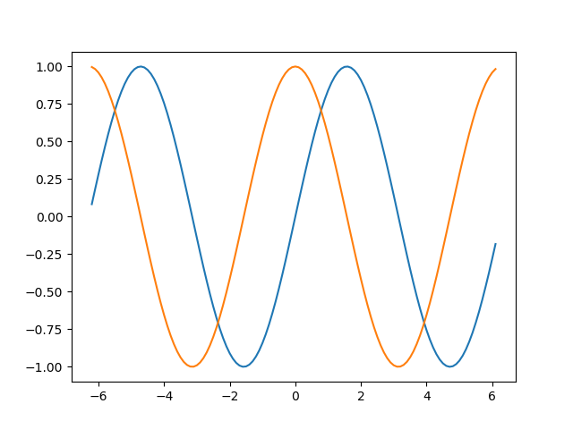

=================
 Builder Pattern
=================

.. admonition:: Verdict

   The Builder Pattern is so convenient
   that it seems to turn up everywhere in Python libraries,
   whether the author knew it was a design pattern or not.
   Happily, Python lacks several constraints
   that in other languages lead to almost every complex class
   needing its own builder.

.. contents:: Contents:
   :backlinks: none

The Pattern
facade
open
file
_io.TextIOWrapper
plt
multiplxing
originally to multiplex
but now just because it’s convenient
Data
h?

Elsewhere: mutable builders for immutable objects

The Builder pattern is second nature to the Python programmer,
many of whom see it every day without ever giving it thought.
Its original purposes were:

* Allowing a single routine
  to drive the creation of several different kinds of object
  depending on which builder it is passed,
  without needing to know their differences or details behind the scenes.

* For the sake of convenience;
  even a routine that only needs to create a single kind of object
  might be able to do so more easily
  if it’s given a builder that automates much of the work.

It turns out that it is this latter purpose
which has taken off in the Python world.
We provide builders to make it convenient to use libraries.
Only rarely do we implement the Builder pattern
so that a single routine can be used to build
more than one system of objects from the same set of builder calls —
a problem for which a better pattern exists,
which will be discussed below.

Beyond the above two uses
for which the Builder pattern was originally proposed,
a novel use has sprung up and become popular
to escape the limits of languages that lack optional keyword arguments.
For the sake of completeness I’ll demonstrate that approach
in the last section of this document.

The Pattern
===========

The Builder pattern recommends
that when a library needs to build
a whole constellation of objects and subordinate objects
whose construction could be described more simply
through a series of method calls,
that the library should avoid sending its users
through the tedium of creating the objects one by one
and instead provide an API taking those parameters
and performing the construction behind the scenes.

A classic example is the `matplotlib <https://matplotlib.org/>`_ library’s
``pyplot`` interface.
Constructing a very simple plot with ``pyplot``
can be accomplished in a single line of code,
and it can be saved to a file with just one line more:

.. testsetup::

   import os
   os.chdir('gang-of-four/builder')

.. testcleanup::

   os.chdir('../..')

.. testcode::

   import numpy as np
   x = np.arange(-6.2, 6.2, 0.1)

   import matplotlib.pyplot as plt
   plt.plot(x, np.sin(x))
   plt.plot(x, np.cos(x))
   plt.savefig('sine.png')

What the pyplot interface
has happily — very, very happily —
hidden from the user here
is that a dozen or more objects had to be created
for matplotlib to represent and manage
all of the components of this plot in Python.
Here, for example, are eight of them:

>>> plt.gcf()
<Figure size 640x480 with 1 Axes>
>>> plt.gcf().subplots()
<matplotlib.axes._subplots.AxesSubplot object at 0x7ff910917a20>
>>> plt.gcf().subplots().bbox
TransformedBbox(
    Bbox(x0=0.125, y0=0.10999999999999999, x1=0.9, y1=0.88),
    BboxTransformTo(
        TransformedBbox(
            Bbox(x0=0.0, y0=0.0, x1=6.4, y1=4.8),
            Affine2D(
                [[100.   0.   0.]
                 [  0. 100.   0.]
                 [  0.   0.   1.]]))))

The creation of this entire cascade of objects
was accomplished by our calls to `plot()`.
While we had the option of providing more keyword arguments
or making additional calls to customize the objects further,
``pyplot`` is happy to insulate us from most of the details
of plots are represented as objects.

The Builder pattern is now deeply ingrained in Python culture,
thanks in part to the pressure that library authors feel
to make the sample code on their front page
as impressively short and convenient as possible.
But there do exist libraries that expect you,
their user, to build the entire object hierarchy above
one object at a time in your own code.

The fact that some libraries
rely on their callers to tediously instantiate objects
is even used as advertisement by their competitors.
For example,
the `Requests library <http://docs.python-requests.org/en/master/>`_
famously introduces itself to users
by comparing its one-liner for making an HTTP request with authentication
with the same maneuver performed with the old
`urllib2 <https://docs.python.org/2/library/urllib2.html>`_
Standard Library module —
which does, in fairness, seem to require the caller
to build a small pile of objects
any time they want to do anything interesting.
The “Examples” section of its documentation provides an illustration::

    import urllib2
    # Create an OpenerDirector with support for Basic HTTP Authentication...
    auth_handler = urllib2.HTTPBasicAuthHandler()
    auth_handler.add_password(realm='PDQ Application',
                              uri='https://mahler:8092/site-updates.py',
                              user='klem',
                              passwd='kadidd!ehopper')
    opener = urllib2.build_opener(auth_handler)
    # ...and install it globally so it can be used with urlopen.
    urllib2.install_opener(opener)
    urllib2.urlopen('http://www.example.com/login.html')

Had the Builder pattern been used here,
the library would instead have offered constructors or methods
that concealed from client code
the actual names of the classes being built.

Building Different Objects
==========================

The examples of the Builder pattern in the previous section decouple code
from the specific classes
that the code is directing the instantiation of.
You simply call ``pyplot.plot()`` or ``requests.get()``
and don’t usually even pay attention to which exact classes
are being created behind the scenes.

When the Gang of Four formally described the Builder pattern,
it is notable they did not consider convenience
to be its most important property.
Instead, they opened their chapter about the pattern
by emphasizing how it decouples code from individual classes
and can therefore let the same code
drive the creation of several different kinds of resulting object:

    “TODO separate the construction of a complex object
    from its representation
    so that the same construction process
    can create different representations.”

At least in Python code,
this seems to be by far the less common
of the two main uses of the Builder pattern.
The Gang of Four use as their example
a text converter
that needs to be able to produce plain text
and also populate an interactive text widget.
They imagine code that calls methods
like “convert character” and “convert paragraph”
which each Builder implements in a way appropriate to its medium.

Hypothetical examples of this sort could, of course, easily be multiplied.
You might want to write only once
the code for producing a certain drawing,
and have the “draw line” method that it is calling
to on one occasion produce the SVG description for that line,
but on another occasion to actually paint pixels across a bitmap
that you are about to save as a `.png` file.

This pattern proves far more rare in Python code
then I think the gang of four, writing in the 1990s,
might have expected.
Maybe the growing and happy popularity of intermediate representations
as the coupling between the different phases of a Python program
we today are far more likely to  write code
that builds an intermediate representation
that an output routine can mend reverse
then we are likely 2 have our drawing code
directly and immediately invoke output routines
you can see this pattern in our first example
matplotlib
all of your plotting commands merely create an intermediate representation
all of those objects
insert example here
that is only turned into real lines on a page
when you have finished manipulating it
and pass it to the output routine

nevertheless examples of the Builder pattern as multiplexer
can be discovered if you look hard enough
here is one very modest example from the python standard Library

even though most applications today
are likely to use a small relational database
for local configuration storage
think of the way that both Chrome and Firefox use sequel light three
also built into python standard Library.
but there was an era in which small key value stores
were very popular
and the python standard Library recalls this legacy
and its various flavors of DDM module
all inheriting in some way or other
from the famous Berkeley database C library

as implementations of the simple key Value Store proliferated
list them here>
the standard Library grew more modules
this presented programmers with a problem
how can they detect which Berkeley database implementations
are available on the platform that python was compiled on
and select which one to use

the standard Library provides a simple Builder pattern as the solution
the any dbm module programmer makes a single call
and receives an instance of whatever
the best supported Berkeley database key value library is
on the current system
given the way the python was compiled
the calling code gets too then use the key value API of the day store
from the question of which exact class has been returned to it
and does not even need to import the correct module itself

in miniature this is the Builder pattern
as originally envisioned by the gang of four
TODO quote about complex

A degenerate case: simulating optional arguments
================================================

For the sake of completeness,
I should describe an alternative Builder pattern
that differs from the pattern described by the Gang of Four,
in case you have seen it in blog posts or books
and have been confused by the difference.
It has arisen recently
in some of the less convenient programming languages than Python,
and substitutes for those languages’ lack
of optional parameters.

The degenerate Builder addresses this problem:

* A programmer designs a class
  with immutable attributes.
  Once a class instance is created,
  its attributes will be impossible to modify.

* The class has not just one or two, but many attributes —
  imagine that it has a dozen.

* The programmer is trapped in a programming language
  that lacks Python’s support for optional arguments.
  A call to the class constructor will need to supply a value
  for every single attribute each time the class is instantiated.

You can imagine the verbose and unhappy consequences.
Not only will every single object instantiation
have to specify every one of the dozen attributes,
but if the language does not support keyword arguments
then each value in the long list of attributes will also be unlabeled.
Imagine reading a long list of values like
``None`` ``None`` ``0`` ``''`` ``None``
and trying to visually pair each value
with the corresponding name in the attribute list.
A comment next to each value can improve readability,
but the language will not provide any guard rail
if a later edit accidentally moves the comments out of sync
with the actual attributes.

To escape their dilemma
and achieve some approximation of the happy brevity
that Python programmers take for granted,
programmers facing this situation
can supplement each class they write with a second class
that serves as a builder for the first.
The differences between the builder and the class is constructs are that:

* The Builder class carries all the same attributes as the target class.

* The Builder class is *not* immutable.

* The Builder class requires very few arguments to instantiate.
  Most or all of its attributes start off with default values.

* The Builder offers a mechanism
  for each attribute that starts with a default value
  to be rewritten with a different value.

* Finally, the Builder offers a method
  that creates an instance of the original immutable class
  whose attributes are copied from the corresponding attributes
  of the Builder instance.

Here is a tiny example in Python —
non-tiny examples are, alas, painful to read
because of their rampant repetition:

.. testcode::

   from collections import namedtuple

   Port = namedtuple('Port', 'number name protocol')

   # Real Python code takes advantage of optional arguments
   # to specify whatever combination of attributes it wants:

   Port(2)
   Port(7, 'echo')
   Port(69, 'tftp', 'UDP')

   # Keyword arguments even let you skip earlier arguments:

   Port(517, protocol='UDP')

   # But what if Python lacked optional arguments?
   # Then we might engage in contortions like:

   class PortBuilder(object):
       def __init__(self, port):
           self.port = port
           self.name = None
           self.protocol = None

       def build(self):
           return Port(self.port, self.name, self.protocol)

   # The Builder lets the caller create a Port without
   # needing to specify a value for every attribute.

   b = PortBuilder(517)
   b.protocol = 'UDP'
   b.build()

At the expense of a good deal of boilerplate —
which becomes even worse if the author
insists on writing a setter for each of the Builder’s attributes —
this pattern allows programmers in deeply compromised programming languages
to enjoy some of the same conveniences
that are built into the design of the Python “call” operator.

This is clearly not the Builder pattern from the Gang of Four.
It fails to achieve every one of the “Consequences”
their chapter lists for the Builder pattern:
its ``build()`` method always returns the same class,
instead of exercising the freedom
to return any of several subclasses of the target class;
it does not isolate the caller
from how the target class represents its data
since the builder and target attributes correspond one-to-one;
and no fine control over the build process is achieved
since the effect is the same — though less verbose —
as if the caller had simply instantiated the target class directly.

Hopefully you will never see a Builder like this in Python,
even to correct the awkward fact that named tuples
provide no obvious way to set a default value for each field —
the
`excellent answers to this Stack Overflow question <https://stackoverflow.com/questions/11351032/namedtuple-and-default-values-for-optional-keyword-arguments>`_
provide several more Pythonic alternatives.
But you might see it in other languages
when reading or even porting their code,
in which case you will want to recognize the pattern
so that you can replace it with something simpler
if the code is re-implemented in Python.
